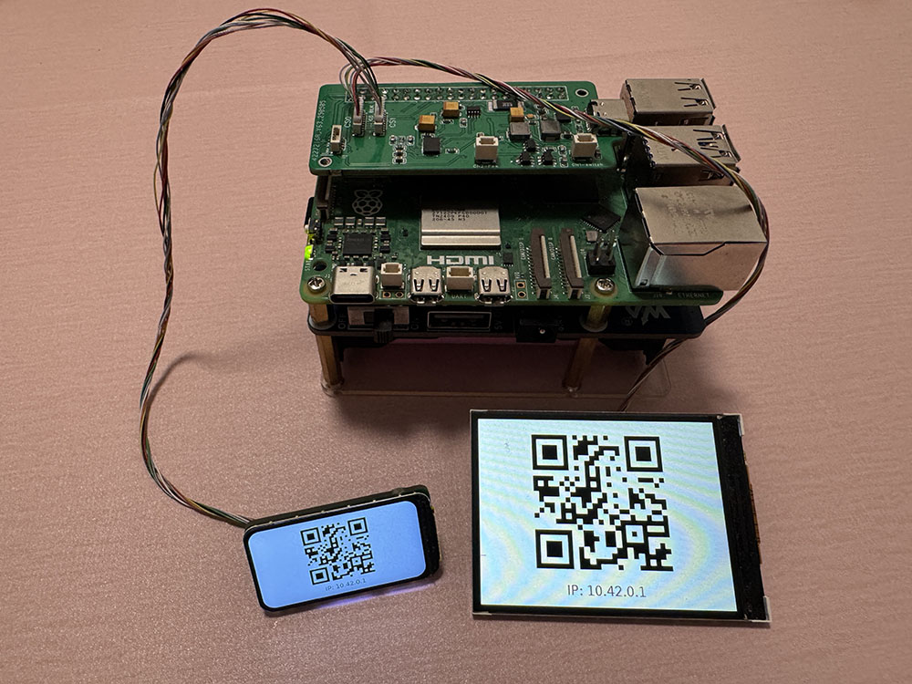
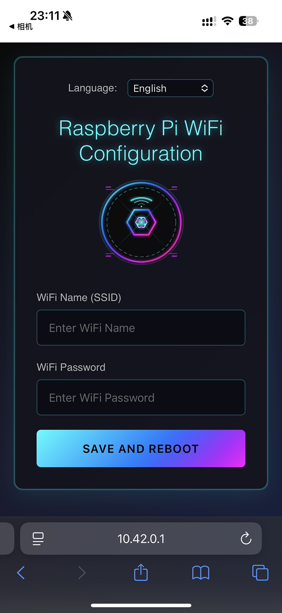
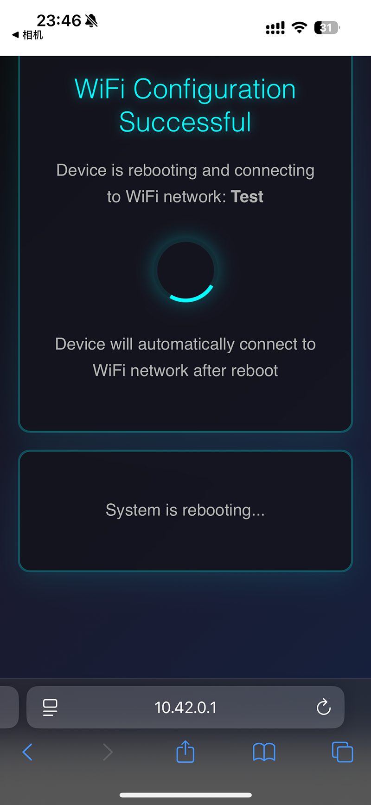
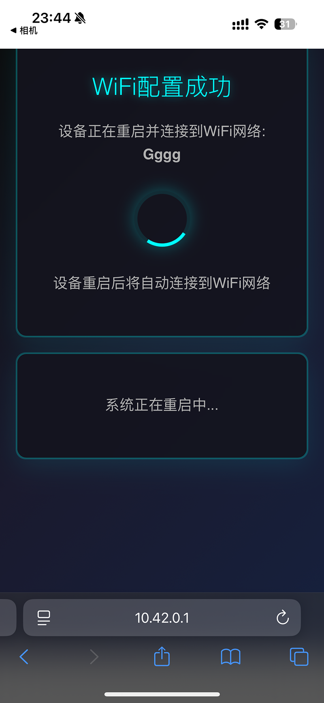
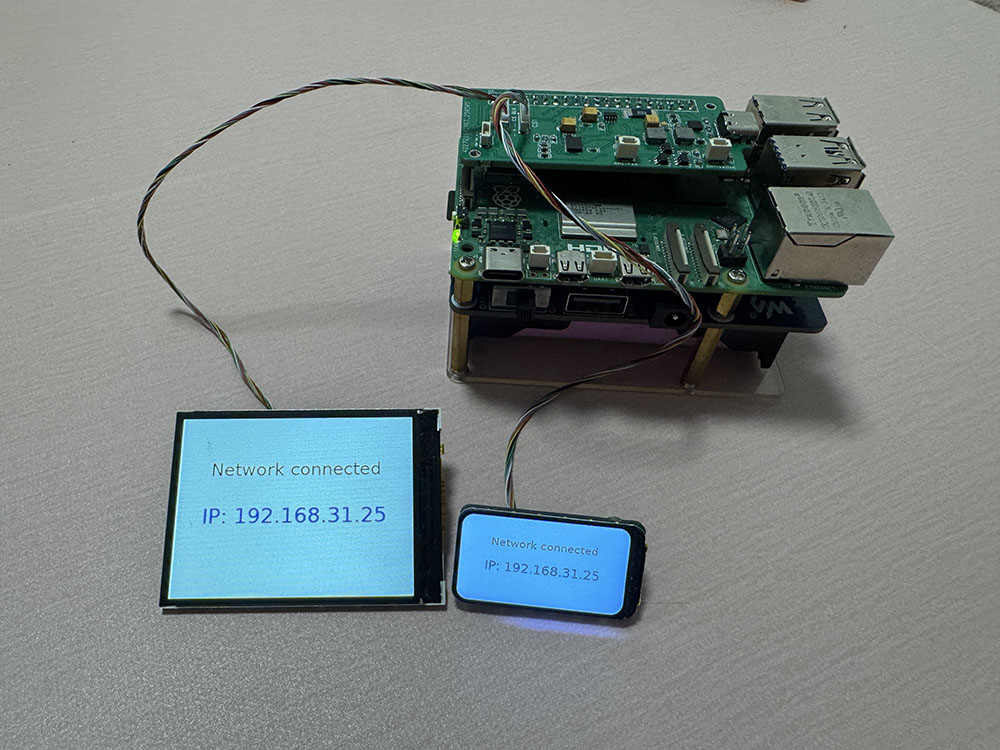
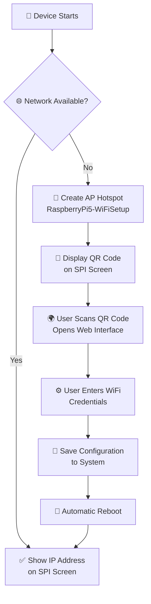

<div align="center">

# 🌐 ApWifi

**Smart WiFi Configuration for Raspberry Pi**

[](https://dotnet.microsoft.com/)
[](https://www.raspberrypi.org/)
[](LICENSE.txt)
[](README.md)

*Seamlessly configure WiFi on your Raspberry Pi through an intuitive web interface with automatic AP hotspot fallback*

[🇺🇸 English](#) • [🇨🇳 中文说明](README.zh-CN.md) • [📖 Documentation](docs/) • [🤝 Contributing](CONTRIBUTING.md) • [🚀 Quick Start](#quick-start)

---

</div>

## 🚀 Quick Start

ApWifi is a robust .NET 9 solution designed for Raspberry Pi devices that transforms WiFi configuration into a seamless experience. When your device is offline, it automatically creates an access point named **"RaspberryPi5-WiFiSetup"**, displays an interactive QR code on your SPI screen, and serves a beautiful web interface for WiFi setup.

*Tested on Raspberry Pi 5, compatible with other Raspberry Pi models*

### ✨ Key Benefits
- 🔄 **Zero-touch setup** - Automatic fallback to AP mode when offline
- 📱 **Mobile-friendly** - Scan QR code with any smartphone
- 🌍 **Multi-language** - Support for 5+ languages with auto-detection
- 🎨 **Modern UI** - Responsive design that works on all devices
- 🔧 **Production ready** - Thoroughly tested on real hardware

---

## 📸 Screenshots

<div align="center">

### 🔌 Offline Mode - QR Code Display


*Device automatically displays QR code on SPI screen when no network is available*

### 📱 WiFi Configuration Interface

<table>
<tr>
<td align="center">

<br><b>🇺🇸 English Interface</b>
</td>
<td align="center">

<br><b>🇨🇳 Chinese Interface</b>
</td>
</tr>
</table>

### ✅ Configuration Success

<table>
<tr>
<td align="center">

<br><b>🔄 Restarting (English)</b>
</td>
<td align="center">

<br><b>🔄 Restarting (Chinese)</b>
</td>
</tr>
</table>

### 🌐 Connected State


*After successful connection, device displays its IP address on the SPI screen*

</div>

---

---

## 📚 Table of Contents

- [🚀 Quick Start](#-quick-start)
- [📸 Screenshots](#-screenshots)
- [⭐ Features](#-features)
- [🎯 How It Works](#-how-it-works)
- [🛠️ Tech Stack & Requirements](#️-tech-stack--requirements)
- [🚀 Installation & Deployment](#-installation--deployment)
- [🤝 Contributing](#-contributing)
- [📝 License](#-license)
- [💬 Support & Community](#-support--community)

## ⭐ Features

<table>
<tr>
<td width="50%">

### 🔥 Core Functionality
- ✅ **Auto AP Hotspot** - Creates "RaspberryPi5-WiFiSetup" network
- ✅ **QR Code Display** - Rendered via SkiaSharp on SPI screen  
- ✅ **Responsive Web UI** - Beautiful, mobile-optimized interface
- ✅ **System Integration** - Direct WiFi configuration via OS commands
- ✅ **Auto Restart** - Seamless transition to configured network

</td>
<td width="50%">

### 🌟 Advanced Features  
- ✅ **Multi-language** - English, Chinese, German, French, Japanese
- ✅ **Hardware Integration** - .NET IoT libraries for SPI displays
- ✅ **Configuration Management** - Liquid templates & JSON config
- ✅ **Production Ready** - Thoroughly tested on Raspberry Pi 5
- ✅ **Auto-detection** - Smart language and network detection

</td>
</tr>
</table>

---

## 🎯 How It Works

<div align="center">



</div>

### 📶 Network Disconnected Mode
- 🚀 Device automatically starts **"RaspberryPi5-WiFiSetup"** AP hotspot
- 🖥️ QR code is rendered using **SkiaSharp** and displayed on **SPI screen**
- 🌐 Local web server runs on AP network for configuration

### 🔧 WiFi Configuration Process  
- 📱 **Mobile-optimized** web interface with real-time validation
- 🌍 **Auto-language detection** with support for 5+ languages
- ⚡ **Instant feedback** and error handling

### ✅ Post-Configuration
- 💾 WiFi settings written directly to **system configuration**
- 🔄 **Automatic reboot** to apply network changes
- 📡 Connects to specified WiFi and displays **IP address on screen**

---

## 🛠️ Tech Stack & Requirements

<div align="center">

### 💻 Core Technologies


</div>

### 📋 Requirements

| Component | Specification | Status |
|-----------|--------------|--------|
| **Platform** | Raspberry Pi (all models) | ✅ Compatible |
| **Tested On** | Raspberry Pi 5 | ✅ Verified |
| **OS** | Raspberry Pi OS (64-bit) | ✅ Verified |
| **Runtime** | .NET 9 SDK | ✅ Required |
| **Display** | SPI-connected screen | ✅ Supported |
| **Libraries** | .NET IoT + SkiaSharp | ✅ Included |
| **Permissions** | Root access for network ops | ⚠️ Required |

### 🧪 Tested Environment
- **Primary Hardware**: Raspberry Pi 5 (ARM64)
- **Compatibility**: All Raspberry Pi models with compatible OS
- **Operating System**: Raspberry Pi OS 64-bit
- **Display**: SPI-connected screen with .NET IoT drivers
- **Graphics**: SkiaSharp rendering engine
- **Networks**: Various WiFi configurations tested

---

## 🚀 Installation & Deployment

### 💻 Development Setup

```bash
# Clone the repository
git clone https://github.com/maker-community/PiWiFiAP.git
cd PiWiFiAP

# Build the project
dotnet build

# Run locally (for development)
dotnet run --project ApWifi.App/ApWifi.App.csproj
```

### 🔧 Production Deployment

<details>
<summary><b>📦 Step 1: Build for ARM64</b></summary>

```bash
# Create optimized build for Raspberry Pi
dotnet publish ApWifi.App/ApWifi.App.csproj \
  -c Release \
  -r linux-arm64 \
  --self-contained \
  -o ./publish
```

</details>

<details>
<summary><b>📤 Step 2: Upload to Raspberry Pi</b></summary>

```bash
# Using SCP (replace with your Pi's IP)
scp -r ./publish pi@192.168.1.100:/home/pi/ApWifi

# Or use FileZilla, WinSCP, or similar tools
# Target directory: /home/pi/ApWifi
```

</details>

<details>
<summary><b>⚙️ Step 3: Configure Auto-start Service</b></summary>

```bash
# SSH into your Raspberry Pi
ssh pi@192.168.1.100

# Create systemd service
sudo nano /etc/systemd/system/apwifi-app.service

# Enable and start the service
sudo systemctl enable apwifi-app.service
sudo systemctl start apwifi-app.service

# Check status
sudo systemctl status apwifi-app.service
```

📖 **Detailed instructions**: See [`scripts/README.md`](scripts/README.md)

</details>

---

## 🤝 Contributing

We welcome contributions! Here's how you can help make ApWifi even better:

<div align="center">

[](https://github.com/maker-community/PiWiFiAP/issues)
[](https://github.com/maker-community/PiWiFiAP/pulls)
[](https://github.com/maker-community/PiWiFiAP/graphs/contributors)

</div>

### 🎯 Ways to Contribute
- 🐛 **Report bugs** or suggest features via [Issues](https://github.com/maker-community/PiWiFiAP/issues)
- 🌍 **Add translations** for new languages
- 📖 **Improve documentation** 
- 🔧 **Submit pull requests** with enhancements
- ⭐ **Star the project** if you find it useful!

---

## 📝 License

This project is licensed under the **MIT License** - see the [LICENSE.txt](LICENSE.txt) file for details.

---

## 💬 Support & Community

<div align="center">

**Found this project helpful? Give it a ⭐!**

[](https://github.com/maker-community/PiWiFiAP/stargazers)
[](https://github.com/maker-community/PiWiFiAP/network/members)

---

**Questions? Issues? Ideas?**

[💬 Start a Discussion](https://github.com/maker-community/PiWiFiAP/discussions) • [🐛 Report a Bug](https://github.com/maker-community/PiWiFiAP/issues) • [📧 Contact](mailto:gil.zhang.dev@outlook..com)

---

*Made with ❤️ for the Raspberry Pi community*

</div>
