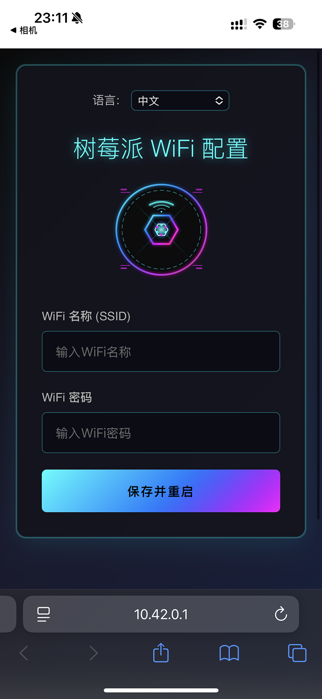
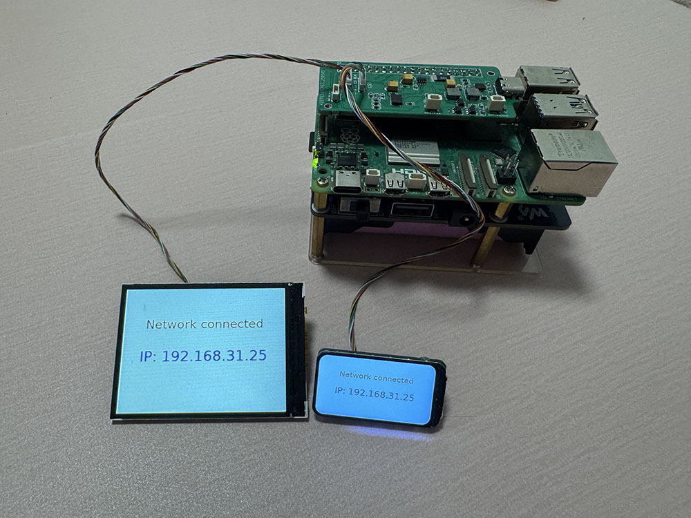

# ApWifi（中文说明）

> ✅ **项目状态：已在树莓派5上测试验证**
>
> 本项目已在运行树莓派OS的树莓派5上成功测试。创建的AP热点名称为"RaspberryPi5-WiFiSetup"，WiFi配置功能运行正常。

<p align="right">
  <a href="README.md">🇺🇸 English</a>
</p>

本项目是为树莓派5设计的.NET 8解决方案，实现了基于AP热点的WiFi配置功能。当设备无网络时自动开启名为"RaspberryPi5-WiFiSetup"的AP热点，生成二维码（在连接的屏幕上显示），并启动本地Web页面用于WiFi配置。配置完成后自动写入系统并重启连接WiFi。

## 功能截图

| 屏幕显示 | WiFi配置界面 |
|:---:|:---:|
|  |  |
| **离线状态**：屏幕显示用于WiFi配置的二维码 | **配置页面**：输入WiFi名称和密码 |

| 配置完成后 | 多语言支持 |
|:---:|:---:|
|  |  |
| **成功页面**：设备正在重启以应用设置 | **英文界面**：完整的多语言本地化支持 |

| 连接成功状态 |
|:---:|
|  |
| **连接成功后**：设备显示其IP地址 |

## 功能特性
- ✅ **已测试**：无网络时自动进入AP热点模式（创建"RaspberryPi5-WiFiSetup"网络）
- ✅ **已测试**：使用.NET IoT库和SkiaSharp渲染在SPI连接的屏幕上生成并显示二维码
- ✅ **已测试**：本地Web服务器提供响应式WiFi SSID/密码输入界面
- ✅ **已测试**：WiFi配置通过系统命令写入树莓派OS
- ✅ **已测试**：配置完成后自动重启并连接WiFi
- ✅ **已测试**：多语言支持（英语、中文、德语、法语、日语）
- 所有AP和WiFi参数均可通过`appsettings.json`和Liquid模板灵活配置

## 使用方法
1. **部署**：部署到运行树莓派OS的树莓派5。
2. **初始设置**：首次启动或离线时，设备自动进入AP模式（创建"RaspberryPi5-WiFiSetup"热点）并在连接的屏幕上显示二维码。
3. **配置**：用手机扫描二维码或连接到AP网络并访问显示的IP地址，打开WiFi配置网页。
4. **WiFi设置**：在Web界面中输入WiFi名称和密码（支持多语言）。
5. **应用设置**：设备自动应用WiFi设置并重启。
6. **连接**：重启后设备连接到配置的WiFi网络并在屏幕上显示其IP地址。

## 工作原理

### 网络断开时
- 设备启动名为"RaspberryPi5-WiFiSetup"的AP热点
- 在连接的屏幕上显示指向配置URL的二维码
- 在AP网络上运行本地Web服务器用于WiFi配置

### WiFi配置过程中
- Web界面允许输入WiFi SSID和密码
- 支持多语言并自动检测语言
- 提供实时反馈和验证

### 配置完成后
- WiFi设置被写入系统配置
- 设备自动重启以应用更改
- 连接到指定的WiFi网络
- 在屏幕上显示分配的IP地址

## 依赖环境
- .NET 8 SDK
- **树莓派5** + **树莓派OS**（已测试验证）
- .NET IoT库用于硬件控制
- 通过SPI连接到树莓派的显示器/屏幕用于二维码显示
- SkiaSharp库用于图像渲染和SPI传输
- 网络配置操作需要root权限

## 测试环境
- **硬件**：树莓派5
- **操作系统**：树莓派OS（64位）
- **运行时**：.NET 8
- **网络**：已在各种WiFi网络上成功测试
- **显示**：已在SPI连接的显示器上测试，使用.NET IoT库和SkiaSharp渲染

## 构建与运行

### 开发环境
```sh
dotnet build
cd ApWifi.App
dotnet run
```

### 部署到树莓派
1. **构建ARM64版本**：
   ```sh
   dotnet publish ApWifi.App/ApWifi.App.csproj -c Release -r linux-arm64 --self-contained
   ```

2. **上传到树莓派**：
   将发布的文件上传到树莓派（例如到 `/home/pi/ApWifi`）

3. **配置开机自启动服务**：
   查看 [`scripts/README.md`](scripts/README.md) 中的详细说明，了解如何设置systemd服务以在开机时自动启动应用程序。

## 注意事项
- **生产就绪**：所有系统配置功能（AP设置、WiFi配置、重启）均已在树莓派OS上测试验证。
- **Root权限**：网络配置和重启等操作需要在树莓派OS上以root权限运行。
- **跨平台**：在非Linux平台上，系统操作会被跳过并显示信息提示，便于开发调试。
- **配置管理**：所有设置和模板均通过`appsettings.json`和`Templates/`目录下的Liquid模板管理。
- **热点名称**：AP热点默认创建名为"RaspberryPi5-WiFiSetup"的网络。
