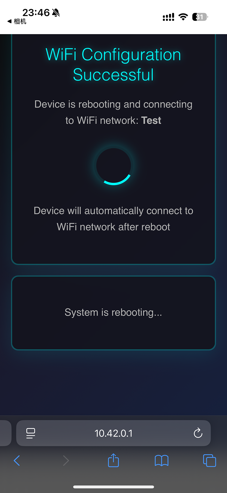

<div align="center">

# 🌐 ApWifi（中文说明）

**树莓派5智能WiFi配置解决方案**

[](https://dotnet.microsoft.com/)
[](https://www.raspberrypi.org/)
[](LICENSE.txt)
[](README.zh-CN.md)

*通过直观的Web界面和自动AP热点回退功能，在树莓派上无缝配置WiFi*

[🇺🇸 English](README.md) • [🇨🇳 中文说明](#) • [📖 文档](docs/) • [🤝 贡献指南](CONTRIBUTING.md) • [🚀 快速开始](#-快速开始)

---

</div>

## 🚀 快速开始

ApWifi是为树莓派5设计的强大.NET 8解决方案，将WiFi配置转化为无缝体验。当设备离线时，自动创建名为**"RaspberryPi5-WiFiSetup"**的接入点，在SPI屏幕上显示交互式二维码，并提供精美的Web界面进行WiFi设置。

### ✨ 核心优势
- 🔄 **零接触设置** - 离线时自动回退到AP模式
- 📱 **移动友好** - 任何智能手机都可扫描二维码
- 🌍 **多语言** - 支持5+种语言并自动检测
- 🎨 **现代UI** - 适配所有设备的响应式设计
- 🔧 **生产就绪** - 在真实硬件上彻底测试

---

## 📸 功能截图

<div align="center">

### 🔌 离线模式 - 二维码显示


*设备在无网络时自动在SPI屏幕上显示二维码*

### 📱 WiFi配置界面

<table>
<tr>
<td align="center">

<br><b>🇨🇳 中文界面</b>
</td>
<td align="center">

<br><b>🇺🇸 英文界面</b>
</td>
</tr>
</table>

### ✅ 配置成功

<table>
<tr>
<td align="center">

<br><b>🔄 正在重启（中文）</b>
</td>
<td align="center">

<br><b>🔄 正在重启（英文）</b>
</td>
</tr>
</table>

### 🌐 连接成功状态


*连接成功后，设备在SPI屏幕上显示其IP地址*

</div>

---

---

## 📚 目录

- [🚀 快速开始](#-快速开始)
- [📸 功能截图](#-功能截图)
- [⭐ 功能特性](#-功能特性)
- [🎯 工作原理](#-工作原理)
- [🛠️ 技术栈与环境要求](#️-技术栈与环境要求)
- [🚀 安装与部署](#-安装与部署)
- [🤝 贡献](#-贡献)
- [📝 许可证](#-许可证)
- [💬 支持与社区](#-支持与社区)

## ⭐ 功能特性

<table>
<tr>
<td width="50%">

### 🔥 核心功能
- ✅ **自动AP热点** - 创建"RaspberryPi5-WiFiSetup"网络
- ✅ **二维码显示** - 通过SkiaSharp在SPI屏幕上渲染
- ✅ **响应式Web界面** - 精美的移动优化界面
- ✅ **系统集成** - 通过OS命令直接配置WiFi
- ✅ **自动重启** - 无缝切换到配置的网络

</td>
<td width="50%">

### 🌟 高级功能
- ✅ **多语言支持** - 英语、中文、德语、法语、日语
- ✅ **硬件集成** - .NET IoT库支持SPI显示器
- ✅ **配置管理** - Liquid模板和JSON配置
- ✅ **生产就绪** - 在树莓派5上彻底测试
- ✅ **自动检测** - 智能语言和网络检测

</td>
</tr>
</table>

---

## 🎯 工作原理

```mermaid
graph TD
    A[🔌 设备启动] --> B{🌐 网络可用？}
    B -->|否| C[📡 创建AP热点<br/>RaspberryPi5-WiFiSetup]
    B -->|是| D[✅ 在SPI屏幕上<br/>显示IP地址]
    C --> E[📱 在SPI屏幕上<br/>显示二维码]
    E --> F[🌍 用户扫描二维码<br/>打开Web界面]
    F --> G[⚙️ 用户输入WiFi<br/>凭据]
    G --> H[💾 保存配置<br/>到系统]
    H --> I[🔄 自动重启]
    I --> D
```

<div align="center">



</div>

### 📶 网络断开模式
- 🚀 设备自动启动**"RaspberryPi5-WiFiSetup"** AP热点
- 🖥️ 使用**SkiaSharp**渲染二维码并在**SPI屏幕**上显示
- 🌐 在AP网络上运行本地Web服务器进行配置

### 🔧 WiFi配置过程
- 📱 **移动优化**的Web界面，具有实时验证功能
- 🌍 **自动语言检测**，支持5+种语言
- ⚡ **即时反馈**和错误处理

### ✅ 配置完成后
- 💾 WiFi设置直接写入**系统配置**
- 🔄 **自动重启**以应用网络更改
- 📡 连接到指定WiFi并在**屏幕上显示IP地址**

---

## 🛠️ 技术栈与环境要求

<div align="center">

### 💻 核心技术


</div>

### 📋 环境要求

| 组件 | 规格说明 | 状态 |
|------|----------|------|
| **平台** | 树莓派5 | ✅ 已测试 |
| **操作系统** | 树莓派OS（64位） | ✅ 已验证 |
| **运行时** | .NET 8 SDK | ✅ 必需 |
| **显示器** | SPI连接屏幕 | ✅ 支持 |
| **类库** | .NET IoT + SkiaSharp | ✅ 已包含 |
| **权限** | 网络操作需root访问 | ⚠️ 必需 |

### 🧪 测试环境
- **硬件**：树莓派5（ARM64）
- **操作系统**：树莓派OS 64位
- **显示器**：SPI连接屏幕，使用.NET IoT驱动
- **图形处理**：SkiaSharp渲染引擎
- **网络**：已在各种WiFi配置下测试

---

## 🚀 安装与部署

### 💻 开发环境设置

```bash
# 克隆仓库
git clone https://github.com/maker-community/PiWiFiAP.git
cd PiWiFiAP

# 构建项目
dotnet build

# 本地运行（用于开发）
dotnet run --project ApWifi.App/ApWifi.App.csproj
```

### 🔧 生产环境部署

<details>
<summary><b>📦 步骤1：构建ARM64版本</b></summary>

```bash
# 为树莓派创建优化构建
dotnet publish ApWifi.App/ApWifi.App.csproj \
  -c Release \
  -r linux-arm64 \
  --self-contained \
  -o ./publish
```

</details>

<details>
<summary><b>📤 步骤2：上传到树莓派</b></summary>

```bash
# 使用SCP（替换为您的树莓派IP）
scp -r ./publish pi@192.168.1.100:/home/pi/ApWifi

# 或者使用FileZilla、WinSCP等工具
# 目标目录：/home/pi/ApWifi
```

</details>

<details>
<summary><b>⚙️ 步骤3：配置开机自启动服务</b></summary>

```bash
# SSH连接到树莓派
ssh pi@192.168.1.100

# 创建systemd服务
sudo nano /etc/systemd/system/apwifi-app.service

# 启用并启动服务
sudo systemctl enable apwifi-app.service
sudo systemctl start apwifi-app.service

# 检查状态
sudo systemctl status apwifi-app.service
```

📖 **详细说明**：查看 [`scripts/README.md`](scripts/README.md)

</details>

---

## 🤝 贡献

欢迎贡献！以下是如何帮助改进ApWifi的方法：

<div align="center">

[](https://github.com/maker-community/PiWiFiAP/issues)
[](https://github.com/maker-community/PiWiFiAP/pulls)
[](https://github.com/maker-community/PiWiFiAP/graphs/contributors)

</div>

### 🎯 参与方式
- 🐛 **报告错误**或通过[Issues](https://github.com/maker-community/PiWiFiAP/issues)建议功能
- 🌍 **添加新语言**翻译
- 📖 **改进文档**
- 🔧 **提交拉取请求**进行功能增强
- ⭐ **点赞项目**如果您觉得有用！

---

## 📝 许可证

本项目采用**MIT许可证** - 详见[LICENSE.txt](LICENSE.txt)文件。

---

## 💬 支持与社区

<div align="center">

**觉得这个项目有帮助吗？给个⭐吧！**

[](https://github.com/maker-community/PiWiFiAP/stargazers)
[](https://github.com/maker-community/PiWiFiAP/network/members)

---

**有问题？遇到问题？有想法？**

[💬 开始讨论](https://github.com/maker-community/PiWiFiAP/discussions) • [🐛 报告错误](https://github.com/maker-community/PiWiFiAP/issues) • [📧 联系我们](mailto:gil.zhang.dev@outlook..com)

---

*为树莓派社区用❤️制作*

</div>
